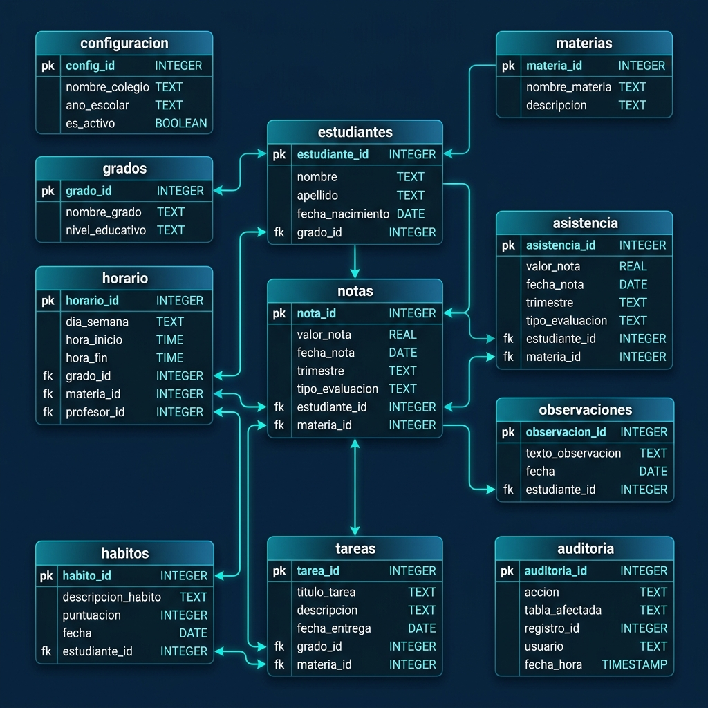

# 📑 DOCUMENTACIÓN TÉCNICA Y DE SEGURIDAD (ISO/IEC COMPLIANCE)
### RegistroDoc Pro — Versión Premium 5.0
---

Este documento técnico detalla la arquitectura de datos, el diseño de la base de datos relacional, los mecanismos de seguridad implementados y su alineación con los estándares internacionales de calidad y seguridad de la información (**ISO/IEC 25010**, **ISO/IEC 27001**, **NIST SP 800-38D**, **NIST SP 800-63B**) y la legislación panameña (**Ley 81 de Protección de Datos Personales**).

---

## 1. Arquitectura y Modelo de Datos (SQLite)

Para cumplir con la **Eficiencia de Rendimiento (ISO/IEC 25010)**, RegistroDoc Pro almacena toda la información académica en una base de datos relacional local **SQLite** de alta velocidad ("hot-data"), eliminando los retrasos y el riesgo de corrupción asociados a la escritura continua sobre archivos Excel directos.

### 📊 Diagrama de Relaciones de la Base de Datos

Se ha diseñado un esquema relacional optimizado para SQLite. A continuación se muestra la representación lógica y la arquitectura visual del esquema:



```
+------------------+         +------------------+         +------------------+
|  CONFIGURACION   |         |     GRADOS       |         |    ESTUDIANTES   |
+------------------+         +------------------+         +------------------+
| clave (PK)       |         | id (PK) ["7A"]   |         | id (PK) [Cédula] |
| valor            |         | modalidad        |         | nombre_cifrado   |
+------------------+         +------------------+         | cedula_cifrada   |
                                      |                   | sexo             |
                                      | 1                 | grado_id (FK)    |
                                      |                   +------------------+
                                      |                               |
                                      | 1..*                          | 1
                                      +-------------------------------+
                                      |
                                      | 1..*
                             +--------+---------+
                             |    MATERIAS      |
                             +------------------+
                             | id (PK, AUTOINC) |
                             | nombre           |
                             | grado_id (FK)    |
                             +------------------+
                                      |
                                      | 1
                                      |
                                      | 1..*
                             +--------+---------+
                             |     NOTAS        |
                             +------------------+
                             | id (PK, AUTOINC) |
                             | estudiante_id(FK)|
                             | materia_id (FK)  |
                             | trimestre [1,2,3]|
                             | tipo             |
                             | descripcion      |
                             | valor [1.0-5.0]  |
                             | puntos_obtenidos |
                             | puntos_maximos   |
                             | fecha ["DD-MM"]  |
                             +------------------+
```

---

### 🗄️ Esquema Detallado de Tablas (DDL)

#### 1. Tabla: `configuracion`
Almacena pares clave-valor de configuración persistente e integridad de la aplicación.
*   **`clave`** (TEXT, PRIMARY KEY): Identificador único de la variable.
*   **`valor`** (TEXT, NOT NULL): Valor configurado (serializado o texto).

#### 2. Tabla: `grados`
Define los grupos asignados al docente.
*   **`id`** (TEXT, PRIMARY KEY): Nombre único del grado y sección (ej. "7A").
*   **`modalidad`** (TEXT, CHECK: `modalidad IN ('primaria', 'premedia')`): Tipo de currículo oficial de MEDUCA.

#### 3. Tabla: `estudiantes`
Directorio de alumnos del salón.
*   **`id`** (TEXT, PRIMARY KEY): Cédula o identificador interno.
*   **`nombre`** (TEXT, NOT NULL): Nombre completo del estudiante (cifrado a nivel columna mediante AES-256 en memoria).
*   **`cedula_cifrada`** (TEXT): Cédula cifrada para resguardar la identidad (Ley 81 de Panamá).
*   **`sexo`** (TEXT, CHECK: `sexo IN ('M', 'F')`): Género del estudiante.
*   **`grado_id`** (TEXT, NOT NULL): Grado al que pertenece. Vinculado por clave foránea (`FOREIGN KEY (grado_id) REFERENCES grados(id) ON DELETE CASCADE`).

#### 4. Tabla: `materias`
Asignaturas impartidas por el docente.
*   **`id`** (INTEGER, PRIMARY KEY AUTOINCREMENT).
*   **`nombre`** (TEXT, NOT NULL): Nombre de la asignatura (ej: "Español").
*   **`grado_id`** (TEXT, NOT NULL): Grado asignado. Vinculado por clave foránea (`FOREIGN KEY (grado_id) REFERENCES grados(id) ON DELETE CASCADE`).

#### 5. Tabla: `horario`
Configuración del planificador de horario semanal de clases.
*   **`id`** (INTEGER, PRIMARY KEY AUTOINCREMENT).
*   **`dia`** (TEXT, CHECK: `dia IN ('Lunes', 'Martes', 'Miércoles', 'Jueves', 'Viernes')`): Día de la semana.
*   **`hora`** (TEXT, NOT NULL): Bloque horario (ej: "07:00 - 07:40").
*   **`materia_id`** (INTEGER, NOT NULL): Clave foránea que referencia a `materias(id)`.
*   **`grado_id`** (TEXT, NOT NULL): Clave foránea que referencia a `grados(id)`.

#### 6. Tabla: `notas`
Almacenamiento de todas las calificaciones de actividades académicas.
*   **`id`** (INTEGER, PRIMARY KEY AUTOINCREMENT).
*   **`estudiante_id`** (TEXT, NOT NULL): Clave foránea que referencia a `estudiantes(id)`.
*   **`materia_id`** (INTEGER, NOT NULL): Clave foránea que referencia a `materias(id)`.
*   **`trimestre`** (INTEGER, CHECK: `trimestre IN (1, 2, 3)`): Trimestre lectivo.
*   **`tipo`** (TEXT, CHECK: `tipo IN ('Diaria / Parcial', 'Apreciación', 'Examen')`): Tipo de evaluación según MEDUCA.
*   **`descripcion`** (TEXT, NOT NULL): Título o descripción de la tarea (ej: "Taller de verbos").
*   **`valor`** (REAL, CHECK: `valor >= 1.0 AND valor <= 5.0`): Nota final obtenida.
*   **`puntos_obtenidos`** (REAL): Puntos reales obtenidos por el alumno.
*   **`puntos_maximos`** (REAL): Puntos máximos posibles para la actividad.
*   **`fecha`** (TEXT, NOT NULL): Fecha de aplicación en formato "DD-MM".

#### 7. Tabla: `asistencia`
Control de ausencias y tardanzas.
*   **`id`** (INTEGER, PRIMARY KEY AUTOINCREMENT).
*   **`estudiante_id`** (TEXT, NOT NULL): Clave foránea que referencia a `estudiantes(id)`.
*   **`fecha`** (TEXT, NOT NULL): Fecha registrada en formato "YYYY-MM-DD".
*   **`estado`** (TEXT, CHECK: `estado IN ('.', '-', 'T', 'E')`): Estado de la asistencia en base a la simbología oficial (. = Presente, - = Ausente, T = Tardanza, E = Excusa).
*   **`motivo`** (TEXT): Detalle o justificación de la ausencia/tardanza.
*   **`trimestre`** (TEXT, CHECK: `trimestre IN ('Trimestre 1', 'Trimestre 2', 'Trimestre 3')`): Trimestre escolar correspondiente a la toma de asistencia.

#### 8. Tabla: `observaciones`
Registro de bitácoras de conducta y méritos.
*   **`id`** (INTEGER, PRIMARY KEY AUTOINCREMENT).
*   **`estudiante_id`** (TEXT, NOT NULL): Clave foránea que referencia a `estudiantes(id)`.
*   **`fecha`** (TEXT, NOT NULL): Fecha en formato "YYYY-MM-DD".
*   **`categoria`** (TEXT, CHECK: `categoria IN ('Conducta', 'Académico', 'Citación', 'Mérito')`): Categoría del expediente.
*   **`texto`** (TEXT, NOT NULL): Detalle y descripción del evento escolar.

#### 9. Tabla: `habitos`
Evaluación periódica de hábitos de estudio y actitudes personales.
*   **`id`** (INTEGER, PRIMARY KEY AUTOINCREMENT).
*   **`estudiante_id`** (TEXT, NOT NULL): Clave foránea que referencia a `estudiantes(id)`.
*   **`trimestre`** (INTEGER, CHECK: `trimestre IN (1, 2, 3)`): Trimestre académico.
*   **`criterio`** (TEXT, NOT NULL): Nombre completo del criterio de hábitos evaluado.
*   **`frecuencia`** (TEXT, CHECK: `frecuencia IN ('Diario', 'Semanal', 'Mensual')`): Frecuencia de la evaluación de hábitos.
*   **`periodo`** (TEXT, NOT NULL): Identificador del período de evaluación correspondiente a la frecuencia (ej: "Día 1", "Semana 3", "Mes 2").
*   **`valor`** (TEXT, CHECK: `valor IN ('S', 'R', 'X')`): Evaluación final (S = Satisfactorio, R = Regular, X = No Satisface).
*   **`fecha`** (TEXT, NOT NULL): Fecha de registro en formato "YYYY-MM-DD".

#### 10. Tabla: `tareas`
Control y recordatorio de evaluaciones planificadas.
*   **`id`** (INTEGER, PRIMARY KEY AUTOINCREMENT).
*   **`titulo`** (TEXT, NOT NULL): Título descriptivo de la tarea pendiente.
*   **`grado_id`** (TEXT, NOT NULL): Clave foránea que referencia a `grados(id)`.
*   **`materia_id`** (INTEGER, NOT NULL): Clave foránea que referencia a `materias(id)`.
*   **`tipo`** (TEXT): Tipo de evaluación.
*   **`fecha_limite`** (TEXT, NOT NULL): Formato "DD-MM-YYYY".
*   **`completada`** (INTEGER, CHECK: `completada IN (0, 1)`): Estado de finalización.

#### 11. Tabla: `auditoria`
Log inmutable para cumplir con estándares de trazabilidad y no repudio.
*   **`id`** (INTEGER, PRIMARY KEY AUTOINCREMENT).
*   **`timestamp`** (TEXT, DEFAULT `strftime('%Y-%m-%d %H:%M:%S', 'now')`): Fecha y hora local de la acción.
*   **`accion`** (TEXT, NOT NULL): Tipo de transacción (ej: `INSERT_NOTA`, `MIGRACION`, `RESPALDO`).
*   **`detalle`** (TEXT, NOT NULL): Registro con detalles no sensibles del cambio (ej: "ID Estudiante: X, Materia: Y, Nota: 4.5").

---

## 2. Arquitectura de Seguridad (🛡️ Anti-Malware & Criptografía)

El sistema integra un diseño de **Defensa en Profundidad** alineado con los estándares del **NIST** y controles del **ISO/IEC 27001 (Anexo A)**.

### A. Criptografía y Protección en Reposo (NIST SP 800-38D / SP 800-63B)
1.  **Cifrado AES-256-GCM**:
    *   La base de datos completa de producción (`data/registro.db.enc`) se mantiene cifrada en el disco duro.
    *   Se utiliza el algoritmo **AES-256 en modo GCM** (Galois/Counter Mode), que provee cifrado autenticado, asegurando la **Confidencialidad** y la **Integridad** de los datos (cualquier modificación física del archivo cifrado abortará la carga).
2.  **Derivación de Llave Criptográfica por Hardware**:
    *   La llave simétrica de cifrado no se almacena en el código ni en archivos planos.
    *   Se genera de forma dinámica en tiempo de ejecución extrayendo la **huella digital del hardware** del dispositivo (combinación del número de serie de la placa madre y procesador del equipo local).
    *   La huella se procesa usando **PBKDF2** con **HMAC-SHA256** utilizando **600,000 iteraciones** y una sal fija única.
3.  **Cifrado a Nivel Columna en Memoria (Doble Capa)**:
    *   Para mitigar ataques de volcado de memoria (Memory Dumping), los campos de `nombre` y `cedula_cifrada` se encriptan a nivel de base de datos SQL con una sub-clave AES-256 secundaria enlazada estrictamente al identificador del proceso de la aplicación (`PID`).
    *   Al cerrarse el programa, se realiza una sobreescritura aleatoria (Wiping) del archivo temporal en memoria/disco virtual para evitar su recuperación física.

### B. Módulo Anti-Análisis y Anti-IA (`src/anti_analysis.py`)
1.  **Anti-Debugging Activo**:
    *   Llamadas nativas de Windows a `IsDebuggerPresent()` para detectar depuradores interactivos en ejecución.
    *   Monitoreo del rastreador del interprete de Python mediante `sys.gettrace()`. Si detecta un depurador, la aplicación se cierra de inmediato.
2.  **Detección de Entornos Virtuales e IA (Virtual Machine/Sandbox Detection)**:
    *   Escanea la presencia de archivos y claves de registro de sistemas de análisis automático y emulación (VirtualBox, VMware, QEMU, Sandboxie).
    *   Si se ejecuta en un sandbox virtual de pruebas automatizadas o análisis estático/dinámico sospechoso, el programa bloquea el descifrado de la base de datos real.
3.  **Bloqueo Automático por Inactividad**:
    *   Un hilo en segundo plano captura eventos globales del ratón y teclado mediante llamadas de sistema Windows. Si transcurren **15 minutos** de inactividad física del docente, el programa bloquea la sesión solicitando autenticación para resguardar la privacidad en el aula.

### C. Protección de Datos y Robustez del Sistema (Ley 81 de Panamá)
1.  **Saneamiento y Anti-SQL Injection**:
    *   Toda consulta SQL utiliza sentencias preparadas parametrizadas (`?`), evitando la inyección de código a través de los cuadros de búsqueda.
    *   El portapapeles es saneado y validado mediante expresiones regulares estrictas antes de permitir pegados masivos de datos.
2.  **Escritura Atómica en Excel**:
    *   Al exportar planillas oficiales o actas, el software escribe los datos en un archivo temporal `.tmp` y luego lo renombra atómicamente. Esto previene que una pérdida de energía corrompa el archivo Excel final del docente.
3.  **Desinstalación Segura mediante Cédula**:
    *   El asistente de desinstalación de Inno Setup exige ingresar la cédula del docente. El desinstalador compara la entrada con el hash criptográfico seguro guardado en el registro de Windows (`HKCU\Software\RegistroDocPro\Cedula`). Si no coincide, detiene la desinstalación para proteger los datos locales de accesos malintencionados.

---

## 3. Matriz de Cumplimiento de Calidad y Estándares (ISO/IEC)

| Característica ISO/IEC 25010 | Mecanismo de Implementación en RegistroDoc Pro | Control de Verificación (Suite de Pruebas) |
| :--- | :--- | :--- |
| **Confidencialidad** | Cifrado AES-256-GCM en reposo + cifrado de columnas en base de datos SQLite. | `tests/test_rdsecurity_crypto.py` |
| **Integridad** | Uso de etiquetas de autenticación (GCM) de 128 bits. Guardado atómico en archivos. | `tests/test_rdsecurity_integrity.py` |
| **Trazabilidad (No repudio)** | Tabla `auditoria` automatizada e inmutable con marcas de tiempo locales. | `tests/test_rdsql.py` (triggers de auditoría) |
| **Comportamiento Temporal** | Acceso en caliente (hot-data) a través de SQLite en lugar de persistencia directa en hojas Excel. | `tests/test_perf_asistencia.py` y `tests/test_perf_db.py` |
| **Aptitud para Pruebas (Testability)**| Aislamiento completo de archivos físicos de prueba usando el fixture `tmp_path` de pytest. | Toda la suite ejecuta de manera aislada en entornos temporales dinámicos. |
